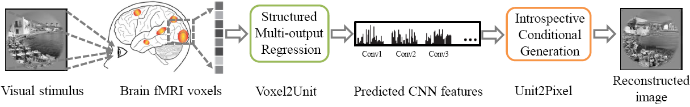
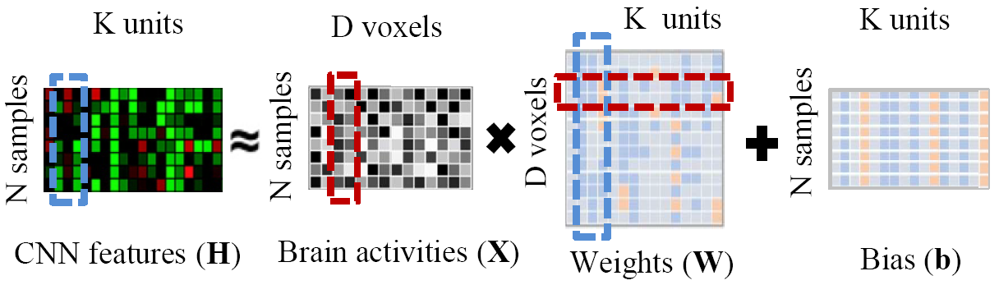
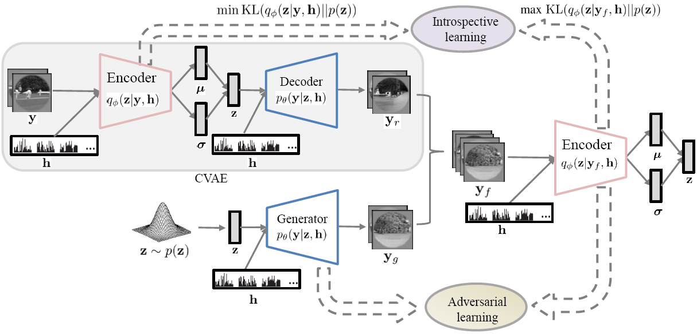
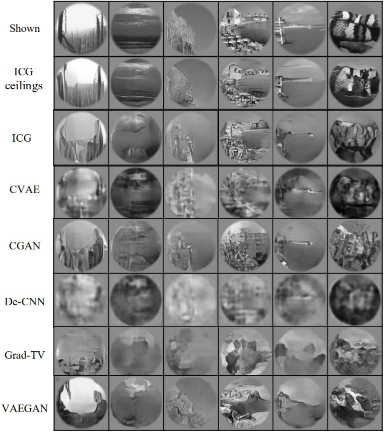
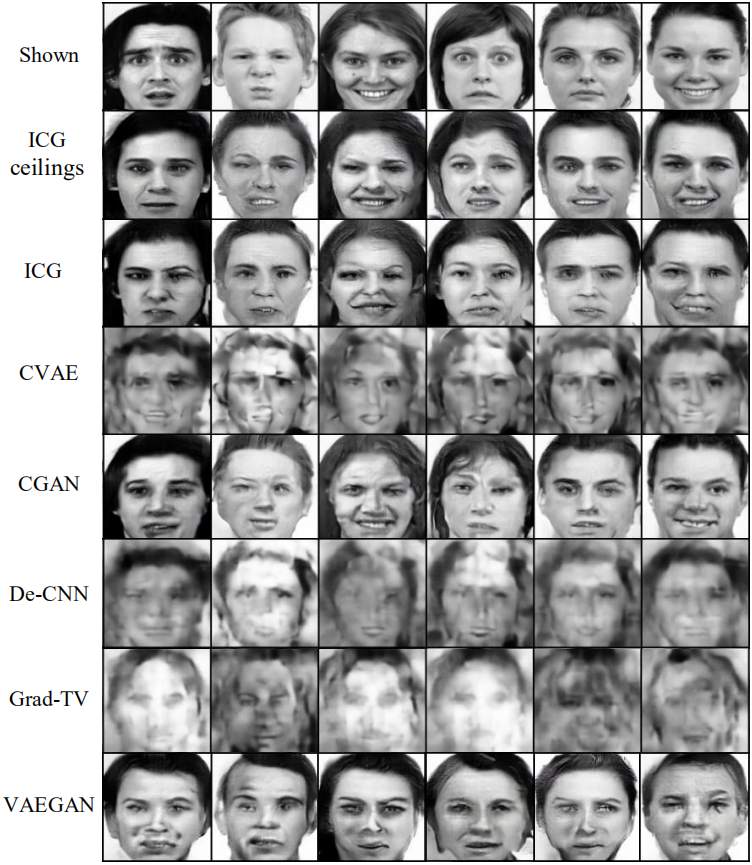

# StructuredNeuroDecoding
Code for IEEE TNNLS 2020 paper "Structured Neural Decoding With Multitask Transfer Learning of Deep Neural Network Representations"


Paper: https://ieeexplore.ieee.org/document/9229132

> The reconstruction of visual information from human brain activity is a very important research topic in brain decoding. Existing methods ignore the structural information underlying the brain activities and the visual features, which severely limits their performance and interpretability. Here, we propose a hierarchically structured neural decoding framework by using multitask transfer learning of deep neural network (DNN) representations and a matrix-variate Gaussian prior. Our framework consists of two stages, Voxel2Unit and Unit2Pixel. In Voxel2Unit, we decode the functional magnetic resonance imaging (fMRI) data to the intermediate features of a pretrained convolutional neural network (CNN). In Unit2Pixel, we further invert the predicted CNN features back to the visual images. Matrix-variate Gaussian prior allows us to take into account the structures between feature dimensions and between regression tasks, which are useful for improving decoding effectiveness and interpretability. This is in contrast with the existing single-output regression models that usually ignore these structures. We conduct extensive experiments on two real-world fMRI data sets, and the results show that our method can predict CNN features more accurately and reconstruct the perceived natural images and faces with higher quality.

----------
## Method:

Framework:\

> Overview of the proposed hierarchically structured neural decoding framework. It involves two cascaded stages, 1) Voxel2Unit: decoding the CNN features from fMRI activity and 2) Unit2Pixel: reconstructing the perceived image using the decoded CNN features.

Stage 1:\

> Voxel2Unit: structured multi-output regression. The red and blue dashed rectangles represent the possible dependencies between the inputs and the outputs, respectively.

Stage 2:\

> Unit2Pixel: Introspective conditional generation. In the training phase, $\mathbf{y}$ comes from large-scale image data (including images without fMRI), and $\mathbf{h}$ is the correspondingly true CNN features. Network parameters are shared between the decoder and the generator, and similarly for the two encoders. In the test phase, we use the generator $p_\theta (\mathbf{y}|\mathbf{z}, \mathbf{h})$ to obtain the image reconstructions, where $\mathbf{z} \sim p(\mathbf{z})$ and  $\mathbf{h}$ is the decoded CNN features.

----------
## Basic usage:
1. Download "[**Vim-1**](https://crcns.org/datasets/vc/vim-1)" and "[**FaceBold**](https://figshare.com/articles/dataset/FaceBold/13019966)" datasets

2. Change Paths 
```
cd src
```

3. Run training.py file 
```
code coming soon
```

## Results:
### 1. Example image reconstructions: 


### 2. Example face reconstructions: 


If you find our work useful in your research or publication, please cite our work:

```
@article{du2020structured,
  title={Structured Neural Decoding With Multitask Transfer Learning of Deep Neural Network Representations}, 
  author={Du, Changde and Du, Changying and Huang, Lijie and Wang, Haibao and He, Huiguang},
  journal={IEEE Transactions on Neural Networks and Learning Systems}, 
  year={2020},
  pages={1-15},
  doi={10.1109/TNNLS.2020.3028167}}
```

```
@inproceedings{du2020conditional,
  title={Conditional Generative Neural Decoding with Structured CNN Feature Prediction.},
  author={Du, Changde and Du, Changying and Huang, Lijie and He, Huiguang}
  booktitle={Proc. AAAI},
  year={2020}
}
```
